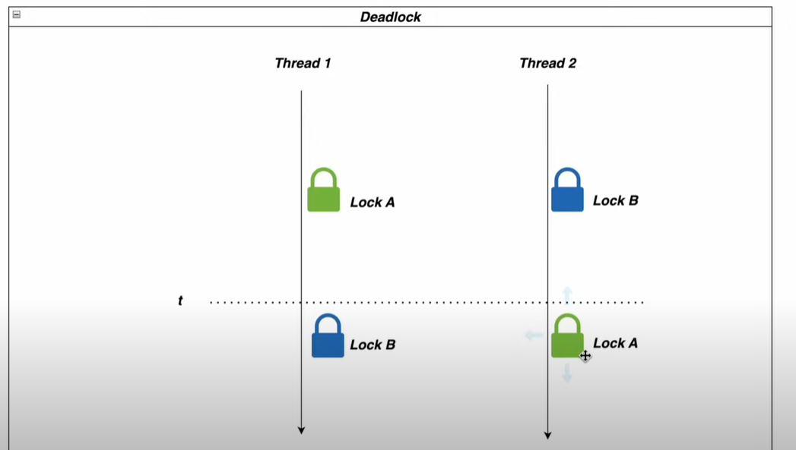

DEADLOCKS
=

How to spot deadlocks ?
-
1. Manual approach
2. Programmatic approach to detect deadlocks - best way (ThreadMXBean)

How to prevent deadlocks ?
-
1. Use timeouts
2. Global ordering of locks
3. Avoid nesting of locks
4. Use Thread safe alternatives 