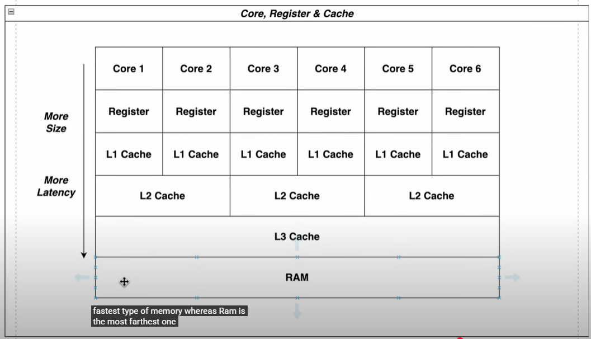
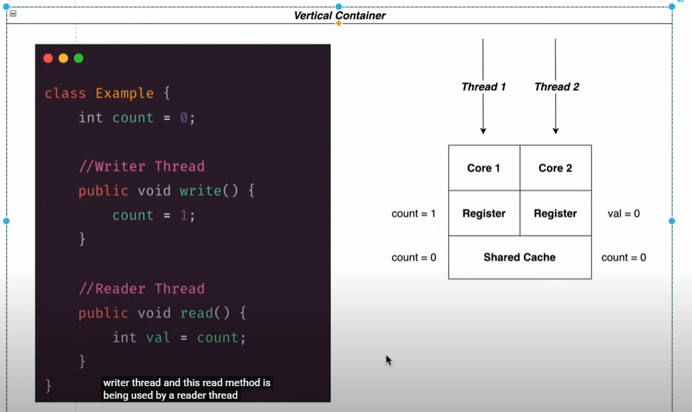

Cores and memory
-
Let's understand the concept of placement of cores in a CPU

As we can see in the diagram, every core is associated
with an extremely fast but very small storage called register.
Then comes the L1 cache followed by the L2 cache.
Now the L2 cache can be shared across cores or maybe specific to a core.

Similarly, L3 cache is shared across cores and finally RAM.

When a thread functions, it updates locally in the register
which percolates to the shared space gradually.

Visibility problem
-

As you can see if the writer thread updates the value of 
count to 1, it first stores in the register and if the 
reader thread reads the value of count before the updated
value of count has percolated to the shared space, the 
reader will read count as 0 which is not the latest value.
This is called as the volatility problem.

Volatile keyword
-
Java provides a solution to the visibility problem by using
the keyword called volatile. The volatile keyword ensures
two things:
1. Whenever there is a change in the value, its flushed to the shared memory
2. Whenever a value is read, its read from the shared memory.

Shared memory in most cases is the L3 cache

Side effect of the volatile keyword
-
Although the volatile keyword ensures that phantom reads
are not done, it slows down the code which ultimately
affects the performance of the application. This is because
when volatile keywords are used, the many layers of caching
are removed and the data is directly flown to the shared spaces
and so the latency and optimization benefits that we gain when
we use caching are all nullified.
